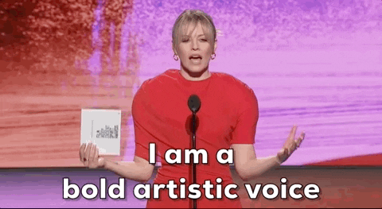

# OpenInfraQuote



_Open Source Infrastructure Cost Quoting_ 🐪


## Using It

We haven't started dev yet, so this represents thinking out loud about what _should_ be, not what _is_.

```
terraform plan -out the_plan.out
terraform show -json the_plan.out > the_plan.json
oiq -p the_plan.json
```

